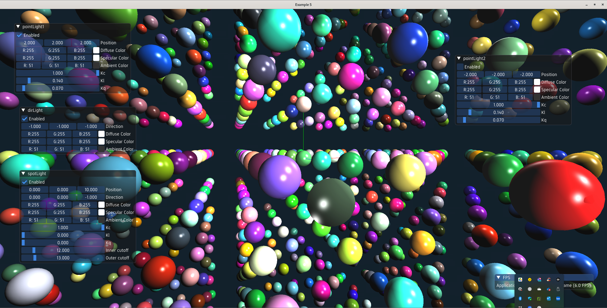

# Interactive Visualisation Framework - Ivf++ 2

Lightweight scene graph library and wrapper over modern OpenGL. 

# Cloning the repository

Clone the repository

    $ git clone https://github.com/jonaslindemann/ivf2.git

# Install Vcpkg

Ivf++ uses Vcpkg for providing the library dependencies. Installation instructions for your platform can be found here:

https://learn.microsoft.com/sv-se/vcpkg/get_started/overview

# Configuring and building for Linux/macOS

Before we configure and build the library we need to configure where Vcpkg can be found. This is done by modifying the CMakePresets.json file in the source directory. 

    {
        "version": 3,
        "configurePresets": [
        {
            "name": "default",
            "toolchainFile": "c:/vcpkg/scripts/buildsystems/vcpkg.cmake"
        },
        {
            "name": "linux",
            "toolchainFile": "/home/XXX/vcpkg/scripts/buildsystems/vcpkg.cmake"
        },
        {
            "name": "macos",
            "toolchainFile": "/Users/XXX/vcpkg/scripts/buildsystems/vcpkg.cmake"
        }
        ]
    }

Modify the section that matches your platform.

The library comes with a tool, ivf2build.sh, which can be used to configure, build and clean the library. To configure the library run the following commands:

    $ ./ivf2build.sh --configure --debug
    $ ./ivf2build.sh --configure --release
    $ ./ivf2build.sh --build --debug
    $ ./ivf2build.sh --build --release

Debug builds are located in the **build-debug** folder and release builds are located in **build-release**. Built libraries are located in the **lib** folder and binaries in the **bin** folder. Examples can be found in the **bin** folder with the **example_n** format.

# Configuring and building for Windows

Before we configure and build the library we need to configure where Vcpkg can be found. This is done by modifying the CMakePresets.json file in the source directory. 

    {
        "version": 3,
        "configurePresets": [
        {
            "name": "default",
            "toolchainFile": "c:/vcpkg/scripts/buildsystems/vcpkg.cmake"
        },
        {
            "name": "linux",
            "toolchainFile": "/home/XXX/vcpkg/scripts/buildsystems/vcpkg.cmake"
        },
        {
            "name": "macos",
            "toolchainFile": "/Users/XXX/vcpkg/scripts/buildsystems/vcpkg.cmake"
        }
        ]
    }

Modify the section that matches your platform.

The library comes with a tool, ivf2build.sh, which can be used to configure, build and clean the library. To configure the library run the following commands:

    C:\...\> ./ivf2build.cmd debug
    C:\...\> ./ivf2build.cmd release

Debug builds are located in the **build-debug** folder and release builds are located in **build-release**. Built libraries are located in the **lib** folder and binaries in the **bin** folder. Examples can be found in the **bin** folder with the **example_n** format.
