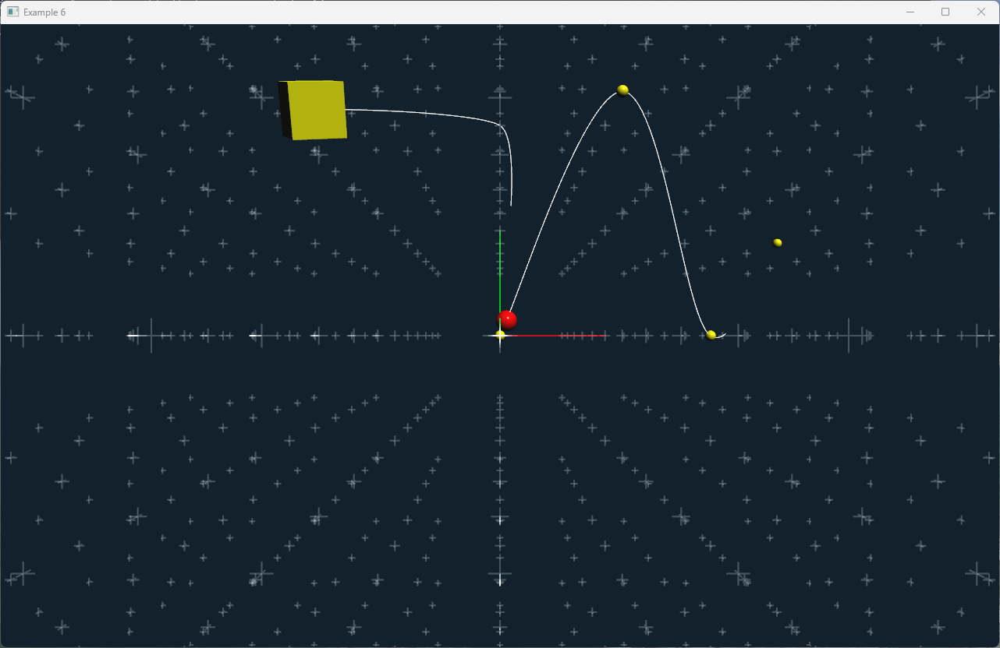

# Animation examples

In the following examples, we will explore how to create animations using the ivf2 library. We will demonstrate how to use the `onUpdate()` function to create smooth animations and how to control animations using ImGui windows.

## Animation using onUpdate()


In this example, we will create a simple animation using the `onUpdate()` function. The animation will move a rectangle across the screen. The elapsedTime() method will be used to determine how much time has passed since the last frame, allowing us to create smooth animations.


### animation1.cpp

```cpp
--8<-- "examples/animation1/animation1.cpp"
```

## Animation controlled by ImGui Window


In this example, we will create a simple animation using the `onUpdate()` function. The animation will move a rectangle across the screen. The elapsedTime() method will be used to determine how much time has passed since the last frame, allowing us to create smooth animations.


### lissajou_window.h 

```cpp
--8<-- "examples/animation2/lissajou_window.h"
```

### lissajou_window.cpp

```cpp
--8<-- "examples/animation2/lissajou_window.cpp"
```

### animation2.cpp

```cpp
--8<-- "examples/animation2/animation2.cpp"
```

## Animation using Splines and Keyframes



In this example, we will create a more complex animation using splines and keyframes. A Sphere will move along a spline path defined by keyframes. The Cube is animated using keyframe anitmation, where the Cube's position and rotation are defined by keyframes. To illustrate the animation a trace is drawn along both of the object using the `LineTrace` node. 

### animation3.cpp

```cpp
--8<-- "examples/animation3/animation3.cpp"
```
