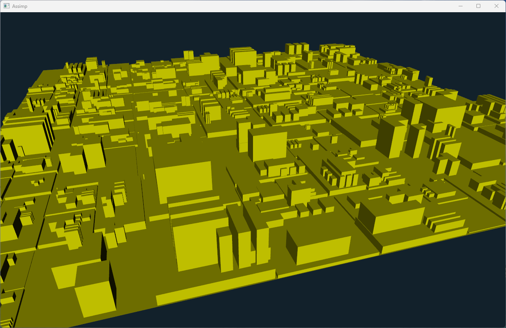

# Asset loading examples

This chapter will explore how to load and use 3D assets in the ivf2 library. We will demonstrate how to load models using the Assimp library, which supports various file formats, and how to apply textures to these models.

## Loading assets using assimp



In this example, we will demonstrate how to load 3D models using the Assimp library. We will create a simple scene with a loaded model and apply basic transformations to it.

### assimp1.cpp

```cpp
--8<-- "examples/assimp1/assimp1.cpp"
```
