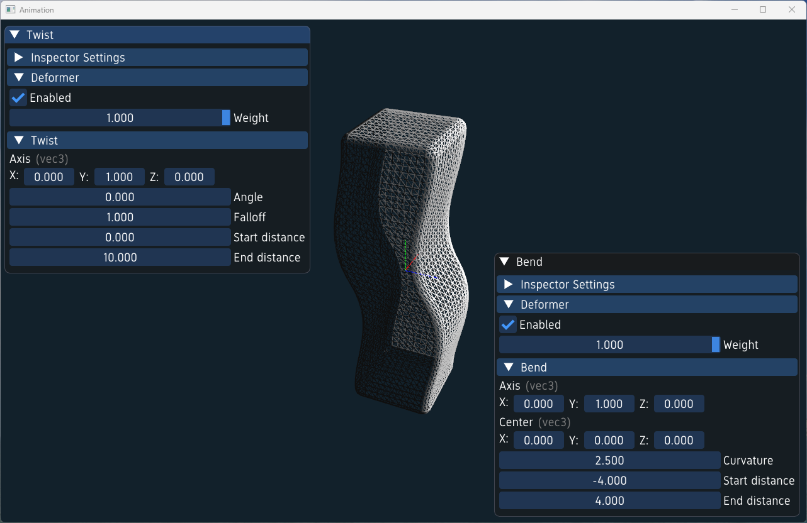
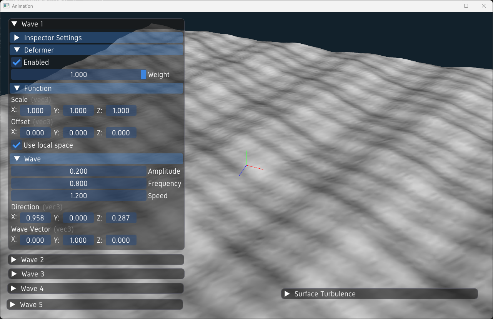
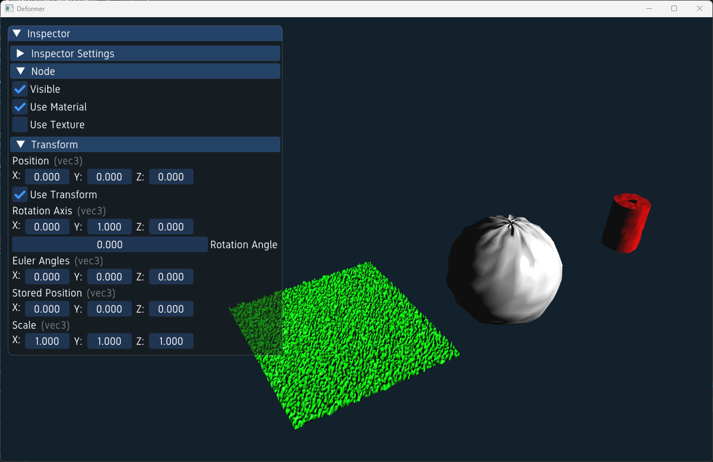

# Deformer examples

In this section, we will explore how to create and use deformers in the ivf2 library. Deformers allow us to manipulate the geometry of 3D objects in various ways, such as bending, twisting, or stretching.

## Simple Deformer Example



In this example, we will create a simple deformer that bends a mesh along a specified axis. The deformer will be applied to a cube mesh, and we will visualize the deformation in the scene. The `ObjectInspector` class will be used to inspect and modify the deformed mesh and its properties.

### deformer1.cpp

```cpp
--8<-- "examples/deformer1/deformer1.cpp"
```

## Advanced Deformer Example



This example demonstrates the use of multiple wave deformers and turbulence to create a dynamic, animated surface effect on a plane mesh. Multiple `ObjectInspector` instances are used to control the parameters of each deformer, allowing for real-time adjustments to the deformation effects.

### deformer2.cpp

```cpp
--8<-- "examples/deformer2/deformer2.cpp"
```

## Random Deformer Example



In this example, we will create a random deformer that applies random noise to the vertices of a mesh. The deformer will be applied to a plane mesh, and we will visualize the random deformation in the scene. The `ObjectInspector` class will be used to inspect and modify the deformed mesh and its properties. Use the 1, 2, and 3 keys to toggle the object inspector to the different deformers. Use Shift to access the deformer parameters.

### deformer3.cpp

```cpp
--8<-- "examples/deformer3/deformer3.cpp"
```