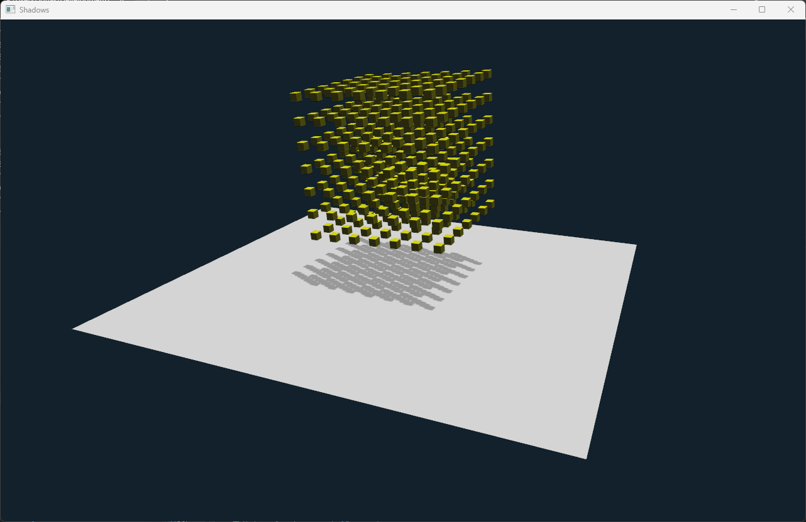

# Effect examples

In this section, we will explore how to create and use effects in the ivf2 library. Effects allow us to apply visual enhancements to the scene, such as post-processing effects, particle systems, and more.


## Post-Processing Effects Example


In this example we illustrate the different post-processing effects available in the ivf2 library. The effects include bloom, depth of field, and motion blur. The `ObjectInspector` class is used to control the parameters of each effect in real-time.

### effects1.cpp

```cpp
--8<-- "examples/effects1/effects1.cpp"
```

## Shadow Mapping Example



In this example, we demonstrate how to implement shadow mapping in the ivf2 library. The scene includes a textured cube and a sphere, with shadows cast by a directional light source. 

### shadows1.cpp

```cpp
--8<-- "examples/shadows1/shadows1.cpp"
```