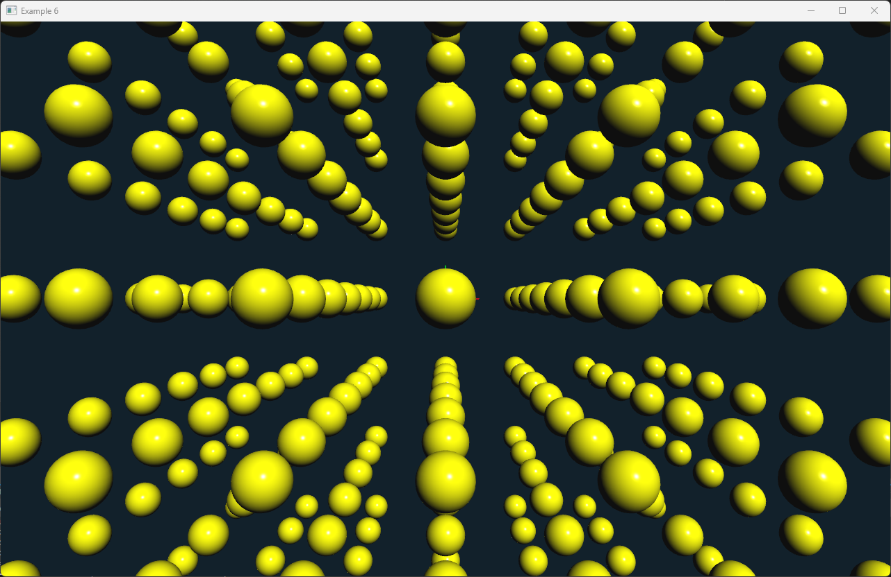

# Interaction Examples

In this chapter, we will explore how to create and use various interaction nodes in the ivf2 library. Interaction nodes allow users to interact with the 3D scene, enabling functionalities such as picking, dragging, and manipulating objects.

## Interaction Example



In this example, we will create a simple scene with multiple objects that can be selected and manipulated using the mouse. The scene will include a ground plane and several colored spheres. 

### selection1.cpp

```cpp
--8<-- "examples/selection1/selection1.cpp"
```