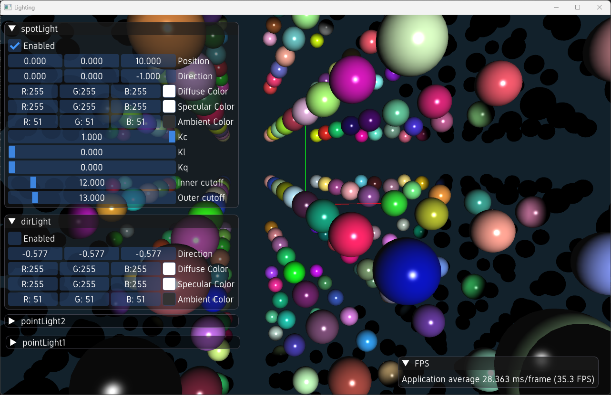

# Lighting examples

I this chapter we will explore how to create and use lighting effects in the ivf2 library. Lighting is essential for creating realistic scenes, as it affects how objects are rendered and perceived by the viewer. The ivf2 library provides various types of lights, including ambient, directional, point, and spotlights, which can be used to illuminate the scene.

## Lighting example



In this example, we will create a simple scene with multicolored spheres, and apply different lighting effects to them. The scene will include ambient, directional, and point lights. Parameters can be controlleed using special inspector windows.

### lighting1.cpp

```cpp
--8<-- "examples/lighting1/lighting1.cpp"
```
