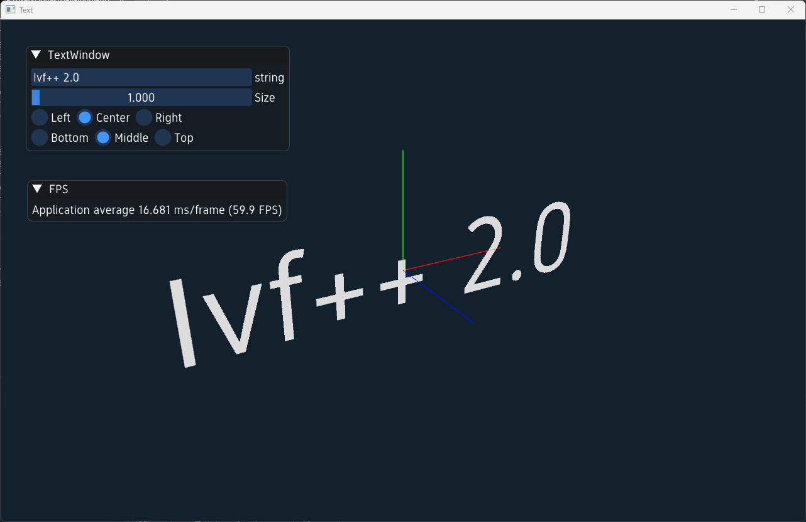

# Primitives Examples

In this chapter we will explore how to create and use various primitive shapes in the ivf2 library. Primitives are basic geometric shapes that can be used as building blocks for more complex models. The ivf2 library provides a variety of primitives, including cubes, spheres, cylinders, cones, planes, toruses, capsules, lines, and capped cylinders. There are also primitives for text and more complex shapes.

## Availble Primitives


Thi example demonstrates the use of various primitive nodes in the ivf2 library. Available primitives include Cube, Sphere, Cylinder, Cone, Plane, Torus, Capsule, Line, and Capped Cylinder.

### primitives1.cpp

```cpp
--8<-- "examples/primitives1/primitives1.cpp"
```

## Text Primitive Example



In this example, we will create a text primitive using the `Text` node. 

## text1.cpp

```cpp
--8<-- "examples/text1/text1.cpp"
```

## Extrusions Example


In this example, we will create an extrusion primitive using the `Extrusion` node. The extrusion will be created from a 2D shape and extruded along a specified path.

### extrusions1.cpp

```cpp
--8<-- "examples/extrusions1/extrusions1.cpp"
```

## Transformations Example


In this example, we will demonstrate how to apply transformations to primitive shapes. We will create a scene with multiple primitives and apply various transformations such as translation, rotation, and scaling to each primitive.

### transforms1.cpp

```cpp
--8<-- "examples/transforms1/transforms1.cpp"
```