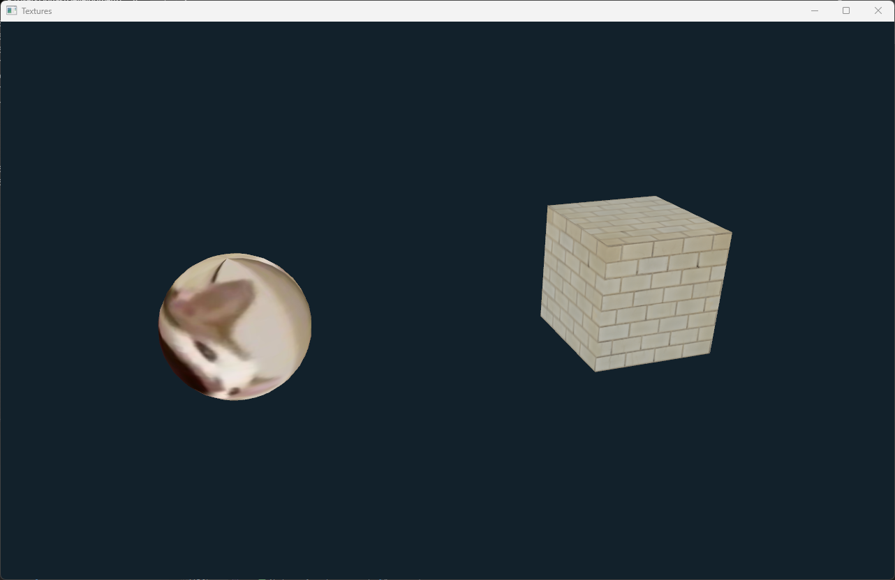

# Texture examples

In this section, we will explore how to create and use textures in the ivf2 library. Textures are essential for adding detail and realism to 3D models, and they can be applied to various objects in the scene.

## Simple Texture Example



In this example, we will create a simple scene with a textured cube an sphere. The texture will be loaded from an image file, and we will apply it to the nodes. Number keys toggle the differen texture modes. The T key toggles the texture on and off.

### textures1.cpp

```cpp
--8<-- "examples/textures1/textures1.cpp"
```

