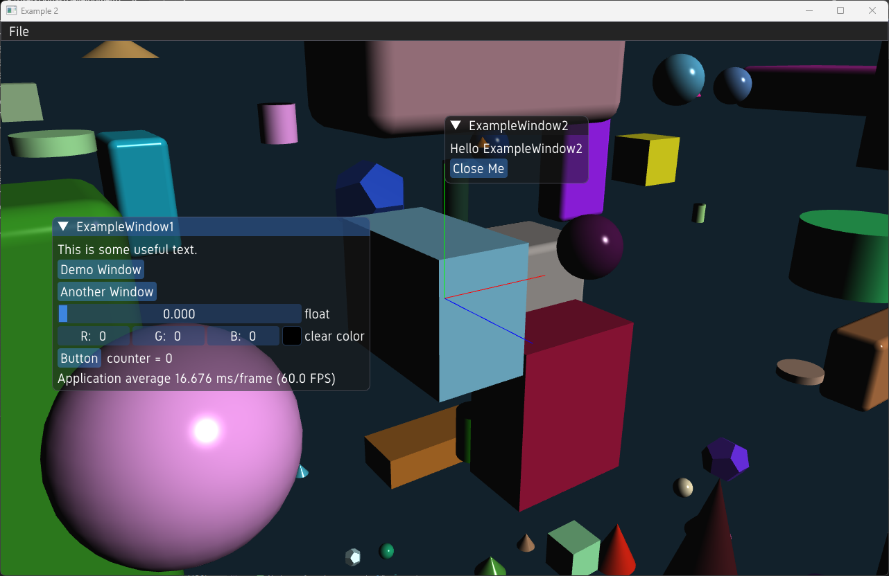

# User interface examples

## User Interface Example



This examples shows how to implement your own user interfaces and menus using the built-in user interface classes. The example includes a simple menu and example windows.

### example_window_1.h

```cpp
--8<-- "examples/scene_ui1/example_window_1.h"
```

### example_window_1.cpp

```cpp
--8<-- "examples/scene_ui1/example_window_1.cpp"
```

### example_window_2.h

```cpp
--8<-- "examples/scene_ui1/example_window_2.h"
```

### example_window_2.cpp

```cpp
--8<-- "examples/scene_ui1/example_window_2.cpp"
```

### scene_ui1.cpp

```cpp
--8<-- "examples/scene_ui1/scene_ui1.cpp"
```